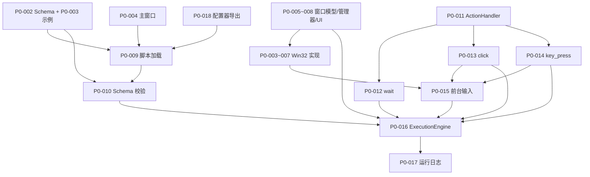
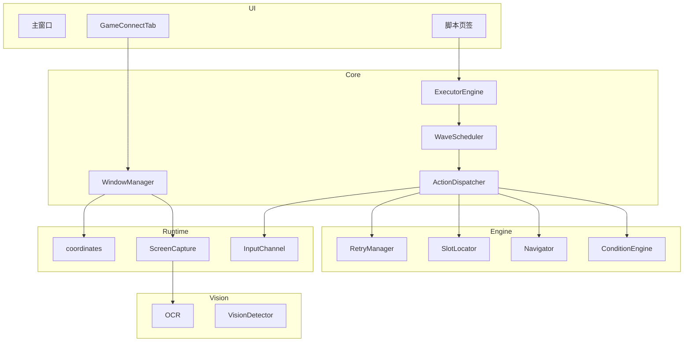

# 塔防自动化执行器模块深入理解

本文档落实「项目与执行器模块深入理解」计划中的调研结论，供阅读代码与参与开发时参考。配套总览见根目录 [`tower_defense_automation_design_v1.md`](../tower_defense_automation_design_v1.md)。

---

## 1. 项目定位

《逆战：未来》塔防模式自动化通关测试系统，由两个子系统通过 **JSON 脚本** 解耦协作：

| 子系统 | 路径 | 说明 |
|--------|------|------|
| 地图配置器 | `map-configurator/` | Electron 可视化编辑、导出 `script.json` |
| 自动化执行器 | `nzfz_executor/` | Python 连接游戏窗口并按脚本执行动作 |

共享契约：`schemas/tower_defense_script_v1.schema.json`

---

## 2. 脚本协议（执行器输入）

### 2.1 顶层结构

| 字段 | 执行器用途 |
|------|------------|
| `schema_version` | 协议版本，模式 `^1\.0\.\d+$` |
| `map` | 地图、难度、`strategy_id`（元数据）、`coordinate_mode`、`initial_view` |
| `runtime` | 超时、重试默认值、各动作后等待毫秒数 |
| `recognition` | `rois`（比例矩形）+ `multi_frame`（多帧投票次数） |
| `traps[]` | `trap_id` → `select_key`、`upgrade_key`、消耗等 |
| `regions[]` | 区域 ID + `enter_actions`（`pan_map` 拖拽序列） |
| `slots[]` | 格子比例坐标、`region_id`、`verify` 校验区 |
| `waves[]` | 波次触发 + 有序 `actions[]` |

坐标模式固定为 `region_screen_ratio`：槽位/ROI 的 `x_ratio`/`y_ratio` 在 **客户区** 内换算像素（依赖 `ConnectedWindow.client_rect`）。

### 2.2 波次（wave）模型

每个 wave 对象：

```json
{
  "wave": 1,
  "name": "第1波初始布防",
  "execute_once": true,
  "trigger": { "type": "wave_eq", "value": 1 },
  "actions": [ /* 有序动作列表 */ ]
}
```

- **`trigger`**：`type` + `value`，由 `WaveScheduler`（规划）结合 OCR 读 `recognition.rois.wave` 判断是否触发。
- **`execute_once`**：同一波次只执行一次（避免重复布防）。
- **`actions`**：严格顺序执行；单动作失败策略由 `retry` / `on_fail` / `on_condition_failed` 决定。

示例脚本 [`schemas/examples/space_station_normal_baseline_v1.json`](../schemas/examples/space_station_normal_baseline_v1.json) 含 3 个波次：第 1 波布防、第 2 波升级、第 5 波拆除。

### 2.3 动作类型（V1）

| type | 必填字段 | 执行器职责（目标） |
|------|----------|-------------------|
| `pan_to_region` | `region_id` | 执行 region 的 `enter_actions`，将地图视野拖到目标区 |
| `place_trap` | `trap_id`, `slot_id`, `conditions`, `verify`, `retry`, `on_fail` | 选陷阱键 → 点击 slot → 视觉校验 |
| `upgrade_trap` | `trap_id`, `target_level`, `execute`, `verify`, … | 按 `execute.method`（如 `hold_key`）升级 |
| `remove_trap` | `slot_id`, `execute`, `verify`, … | 拆除指定 slot |
| `log` | `message` | 仅写日志，无游戏操作 |

**横切字段（塔防动作共有）：**

- `conditions`：如 `resource_gte`、`slot_empty`、`slot_occupied`、`trap_level_lt`
- `on_condition_failed`：`policy`（`wait`/`skip`）、`timeout_ms`、`then`
- `verify`：如 `slot_has_trap`、`slot_empty`、`trap_level_gte`
- `retry`：`max_count`、`interval_ms`、`reset_view_before_retry`、`micro_adjust_on_retry`
- `on_fail`：`policy`（如 `skip`）

### 2.4 示例：第 1 波 `place_trap` 数据流

```
WaveScheduler 匹配 wave_eq=1
  → ActionDispatcher 收到 place_trap
    → ConditionEngine: resource_gte=500, slot_empty=A01
    → Navigator: pan_to_region(entrance_left)  [同波次前序动作可能已 pan]
    → 查 traps[] 得 select_key="1"
    → SlotLocator: ratio (0.452, 0.561) → 客户区像素
    → InputChannel: press_key("1"), click_slot
    → Vision: verify slot_has_trap
    → RetryManager: 失败则 reset_view + micro_adjust 重试
```

---

## 3. 当前实现：窗口连接调用链

执行器 **唯一已落地** 的垂直切片为 P0-005~008（模型 + 管理器 + UI）。调用关系如下。

### 3.1 分层图

```
GameConnectTab (PySide6)
    │ search_windows / disconnect / check_health (主线程)
    │ connect → ConnectWorker (QThread)
    ▼
WindowManager (纯 Python，无 Qt)
    │ P0-03: Win32 枚举窗口
    │ P0-04~07: 绑定 hwnd、取 client_rect
    ▼
pywin32 + psutil (Windows only)
```

### 3.2 数据模型（`nzfz_executor/core/models.py`）

| 类型 | 角色 |
|------|------|
| `WindowRect` | 屏幕坐标矩形；`width`/`height`/`is_valid()` |
| `WindowInfo` | 搜索快照；**连接前必须重新校验** |
| `ConnectedWindow` | 运行时锚点：`hwnd`、`window_rect`、`client_rect`、`dpi_scale` |
| `ConnectOptions` | `activate_on_connect`、`control_mode`（后台能力预留） |
| `ConnectResult` | `ok()` / `fail()` 工厂 |
| `HealthCheckResult` | `HealthStatus` + 可选刷新后的 `ConnectedWindow` |

### 3.3 WindowManager API（`nzfz_executor/core/window_manager.py`）

| 方法 | 当前分支行为 | 后续阶段 |
|------|--------------|----------|
| `search_windows(keyword)` | 依赖检查通过后返回 `[]` | P0-03 真实枚举 + `match_score` |
| `connect_window(info, options)` | `fail("窗口连接功能尚未实现")` | P0-04~07 校验 + 激活 + 填充 `ConnectedWindow` |
| `disconnect_window()` | 清空 `_connected_window`，不碰游戏窗口 | 已实现语义 |
| `check_health()` | 未连接 → `NOT_CONNECTED`；已连接 → 暂恒 `HEALTHY` | P1-01 句柄/进程/最小化检测 |

职责边界（文档注释）：不负责 GUI 线程、截图、输入、自动重连。

### 3.4 UI 状态机（`nzfz_executor/ui/tabs/game_connect.py`）

```
DISCONNECTED ──connect──► CONNECTING ──success──► CONNECTED
                │              │ timeout              │
                │              ▼                      ├──health fail──► ABNORMAL
                │           TIMEOUT                   │                      │
                │                                       ◄──health recover────┘
                └── disconnect ◄────────────────────────────────────────────
```

要点：

- 连接在 `ConnectWorker` 后台线程，5s `QTimer` 超时强杀线程。
- 已连接时换窗：确认框 → `_do_disconnect()` → 新连接。
- 连接成功后 `QTimer` 每 1s 调用 `check_health()`。
- 搜索结果按 `match_score` 降序；空结果合并单元格显示「无匹配结果」。

### 3.5 与后续模块的衔接

`ConnectedWindow.client_rect` 将作为：

- `runtime/coordinates.ratio_to_pixel` 的输入
- `ScreenCapture` 的截图区域
- 前台 `InputChannel` 的坐标系

---

## 4. 旧版 td_executor → nzfz_executor 模块映射

仓库内 **无** `automation-executor/` 源码；[`deprecated/docs/`](../deprecated/docs/) 与 [`.trae/specs/`](../.trae/specs/) 描述旧包结构，可作为新包实现蓝图。

### 4.1 目录对照

| td_executor（旧） | nzfz_executor（规划/现状） | 状态 |
|-------------------|---------------------------|------|
| `cli.py` / `__main__.py` | `nzfz_executor/__main__.py` + CLI | 未实现 |
| `state.py` → `GameState` | `core/state.py` 或 `runtime/state.py` | 未实现 |
| `script/load.py` | `script/load.py` | 未实现 |
| `script/validate.py` | `script/validate.py` | 未实现 |
| `runtime/window.py` | `core/window_manager.py` + `core/models.py` | **骨架** |
| `runtime/capture.py` | `runtime/capture.py` | 未实现 |
| `runtime/coordinates.py` | `runtime/coordinates.py` | 未实现 |
| `runtime/input.py` | `runtime/input.py` / P0-015 输入通道 | 未实现 |
| `runtime/overlay.py` | `runtime/overlay.py` | 未实现 |
| `vision/ocr.py` | `vision/ocr.py` | 未实现 |
| `vision/detector.py` | `vision/detector.py` | 未实现 |
| `engine/action.py` → `ActionExecutor` | `engine/action.py` + `core/dispatcher.py` | 未实现 |
| `engine/condition.py` | `engine/condition.py` | 未实现 |
| `engine/navigator.py` | `engine/navigator.py` | 未实现 |
| `engine/slot.py` | `engine/slot.py` | 未实现 |
| `engine/retry.py` | `engine/retry.py` | 未实现 |
| `engine/report.py` | `engine/report.py` | 未实现 |
| `engine/batch.py` | `engine/batch.py` | 未实现 |
| `ui/app.py` (Tkinter) | PySide6 主窗口 + tabs | 仅 `game_connect.py` |
| `ui/executor_bridge.py` | 执行线程桥（待设计） | 未实现 |

### 4.2 核心类对照

| 旧 | 新（`core/__init__.py` 预声明） | 职责 |
|----|--------------------------------|------|
| `ExecutorBridge.start_execution` | `ExecutorEngine` | 加载脚本、驱动主循环、对接 UI |
| （波次循环在 bridge 内） | `WaveScheduler` | 匹配 `waves[].trigger` |
| `ActionExecutor.execute` | `ActionDispatcher` + `ActionHandler` | 按 `type` 分发 |
| `execute_with_retry` 管线 | `ExecutionPipeline` | 条件 → 执行 → 校验 → 重试 |
| `find_game_window` / `list_windows` | `WindowManager.search_windows` | 搜索 |
| 连接状态在 `GameState` | `ConnectedWindow` + UI `ConnectState` | 窗口上下文 |

### 4.3 `.trae/specs` 与 P 级需求对应

| Spec 目录 | 主要交付 | 优先级 |
|-----------|----------|--------|
| `implement-game-window-manager` | `runtime/window.py` Win32 | → 已并入 `WindowManager` P0-03~07 |
| `implement-screen-capture` | `ScreenCapture` | P3 / 动作前依赖 |
| `implement-key-action-basics` | `press_key`, `click_at`, `drag` | P0-012~015 |
| `implement-map-navigator` | `pan_to_region` | P1 |
| `implement-slot-positioning` | `locate_slot`, `click_slot` | P1 |
| `implement-condition-engine` | `ConditionEngine` | P1 |
| `implement-retry-framework` | `RetryManager` | P1 |
| `implement-action-execution` | `ActionExecutor` 完整流程 | P1 |
| `implement-ocr-recognition` | 波次/资源 OCR | P3 |
| `implement-vision-detector` | 地图 UI、格子状态 | P3 |
| `add-executor-gui` | Tkinter 多页签 | → 新实现改用 PySide6 |
| `fix-window-connect-ux` | 选窗对话框 | → 部分已在 `GameConnectTab` |

---

## 5. P0 路线图与实现依赖

P0 目标：**最小工程闭环**（非完整自动通关）。推荐顺序见 [`spec/需求拆分文档 v1.0.md`](../spec/需求拆分文档%20v1.0.md) §10。

### 5.1 依赖关系图



### 5.2 分项说明

| 编号 | 内容 | 前置依赖 |
|------|------|----------|
| P0-001 | `pyproject.toml`、`__main__.py` | 无 |
| P0-004 | 主窗口 + 多页签骨架 | P0-001 |
| P0-005~008 | 窗口连接 | `models.py` ✅；Win32 待接 |
| P0-009~010 | 加载 + jsonschema 校验 | Schema 文件 ✅ |
| P0-011 | `actions/base.py`：`ActionHandler`, `ActionResult` | 无 |
| P0-012~014 | wait / click / key_press | P0-011；click 需 `ConnectedWindow` + 坐标换算 |
| P0-015 | 前台输入 | P0-006 真实连接 + 激活窗口 |
| P0-016 | `ExecutorEngine` 顺序执行 `waves[].actions` | P0-009~015；塔防语义动作可后移 P1 |
| P0-017 | 日志面板 / 文件 | P0-016 |
| P0-018 | 配置器导出合法 JSON | 与执行器并行；联调点 |

**注意：** `nzfz_executor/core/__init__.py` 已 `import` 不存在的 `engine`、`dispatcher`、`pipeline`、`scheduler`，在 P0-016 前应改为惰性导出或占位，避免 `from nzfz_executor.core import ExecutorEngine` 直接失败。

### 5.3 P1 及以后（执行器能力扩展）

- **P1**：`place_trap` / `upgrade_trap` / `remove_trap`、`pan_to_region`、真实健康检测、暂停继续停止。
- **P2**：配置器体验、错误处理、DPI/坐标优化。
- **P3**：OCR、Vision、`dxcam` 截图、后台输入（`ControlMode.BACKGROUND`）。

---

## 6. 目标架构总览



**粗体实线**：已有代码（`WindowManager` 系列 + `GameConnectTab`）。其余为规划或仅存在于 deprecated 文档。

---

## 7. 已知不一致与风险

1. 根目录 [`README.md`](../README.md) 仍指向不存在的 `automation-executor/`、`td_executor`。
2. GUI 规格（Tkinter）与实现（PySide6）不一致。
3. 无 `pyproject.toml`，包不可 `pip install -e .`。
4. Linux CI/开发机无法验证真实 Win32 连接。
5. `core/__init__.py` 超前 import 未实现模块。

---

## 8. 推荐阅读顺序

1. [`tower_defense_automation_design_v1.md`](../tower_defense_automation_design_v1.md) §3、§5.2、§7  
2. [`schemas/tower_defense_script_v1.schema.json`](../schemas/tower_defense_script_v1.schema.json) + 示例脚本  
3. `nzfz_executor/core/models.py` → `window_manager.py` → `ui/tabs/game_connect.py`  
4. [`spec/需求拆分文档 v1.0.md`](../spec/需求拆分文档%20v1.0.md) P0/P1  
5. [`deprecated/docs/engine.md`](../deprecated/docs/engine.md) + `.trae/specs/implement-action-execution/spec.md`
